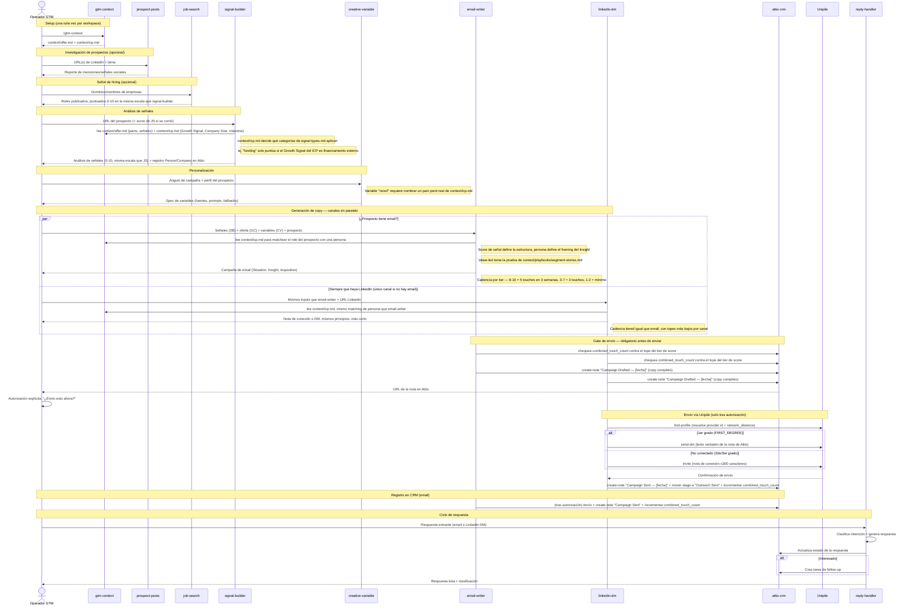

# Pipeline de Outreach — Secuencia de Skills

## Notas del flujo

- **`job-search`** (nuevo en el diagrama) corre opcionalmente antes de `signal-builder` y puntúa hiring signals 0-10 en la **misma escala** que `signal-builder` — ya no hay dos escalas de intent sin reconciliar (High/Medium/Low vs. 1-10).
- **`signal-builder`** ahora carga `context/icp.md` además de `context/offer.md`: el Growth Signal, Company Size e Industria del ICP deciden qué categorías del catálogo genérico `reference/signal-types.md` aplican. El catálogo quedó ICP-agnóstico — no tiene hardcodeado si "funding" aplica o no, lo decide `context/icp.md` en cada corrida.
- **`email-writer`** y **`linkedin-dm`** ahora resuelven el patrón de copy con una **matriz 2D**: el score de señal define la estructura (Pain-led / Value-led / Segment fallback), y la persona matcheada contra `context/icp.md` (por el campo `role` del prospecto) define cómo se enmarca la línea Insight — antes solo se usaba el score.
- **Value-led** en ambas skills busca la prueba/caso de uso en `context/playbooks/segment-stories.md` (nuevo archivo) antes de inventar una métrica; si no hay entrada para ese segmento, cae al value prop general de `offer.md`.
- **Cadencia de follow-up** ahora es tiered por score en vez de fija: score 8-10 llega a 5 touches de email en ~3 semanas, 3-7 se queda en el ritmo original (3 email + 1 LinkedIn), 1-2 se queda en el mínimo — evita mandar el mismo volumen a un prospecto de señal débil.
- **`combined_touch_count`** (nuevo campo en Attio) es un contador compartido entre `email-writer` y `linkedin-dm`: el gate de envío de ambas skills lo chequea contra el tope del tier antes de mandar, así el total de touches cross-channel respeta la cadencia tiered, no solo el conteo por canal.
- **`creative-variable`**: una variable "novel" ya no se acepta solo con "justificación" genérica — tiene que nombrar un pain point real de la tabla de personas en `context/icp.md`, si no, se rechaza de vuelta a uno de los 4 arquetipos estándar.
- **`context/icp.md`** ahora también trae una tabla de **Contact Orchestration** (cuántos contactos perseguir por tamaño de cuenta y en qué dirección — top-down dado el ranking de personas ya existente).
- El gate de aprobación original se mantiene igual: ninguna copia se manda sin nota `Campaign Drafted` en Attio y autorización explícita del operador. Tras el envío, nota `Campaign Sent` + cambio de etapa del pipeline, ahora sumado al incremento de `combined_touch_count`.

---

Diagrama actualizado en la misma URL: https://claude.ai/code/artifact/31d0b78c-dd83-45ea-9fe0-096277a0c706

Cambios en el diagrama (2026-08-05) — implementación de los puntos 1, 3, 4, 6, 7, 8, 9 y 10 de `Documents/Decisions/Outbound_Playbook_Alignment.md`:

Nuevo participante job-search, corriendo opcional antes de signal-builder y puntuando en la misma escala 0-10 (ya no hay dos escalas de intent sin reconciliar).
signal-builder ahora lee context/icp.md (Growth Signal, Company Size, Industria) además de offer.md, para decidir qué categorías de reference/signal-types.md aplican a la ICP actual — el catálogo quedó ICP-agnóstico.
email-writer y linkedin-dm ahora resuelven el patrón de copy con una matriz 2D: score de señal define la estructura, persona matcheada contra context/icp.md (por el role del prospecto) define el framing de la línea Insight.
Value-led en ambas skills busca la prueba en el nuevo context/playbooks/segment-stories.md antes de inventar una métrica.
Cadencia de follow-up tiered por score (8-10 = 5 touches/3 semanas, 3-7 = ritmo original, 1-2 = mínimo) en vez de fija.
Nuevo campo combined_touch_count en Attio, compartido entre email-writer y linkedin-dm — el gate de envío de ambas skills lo chequea contra el tope del tier antes de mandar.
creative-variable: variable "novel" ahora requiere que la justificación nombre un pain point real de la tabla de personas en context/icp.md.
context/icp.md suma una tabla de Contact Orchestration (contactos por tamaño de cuenta y dirección top-down/bottom-up).

Cambios previos en el diagrama:

Agregado el flujo paralelo email-writer / linkedin-dm (bloque par), dependiendo de si el prospecto tiene email.
Nuevo participante Unipile, con la lógica de find-profile → DM directo (1er grado) o invitación con nota (no conectado).
Agregado el gate de aprobación: ambas skills crean una nota Campaign Drafted en Attio y requieren autorización explícita del operador antes de enviar — nada sale automáticamente.
Nota Campaign Sent + cambio de etapa del pipeline tras el envío confirmado.