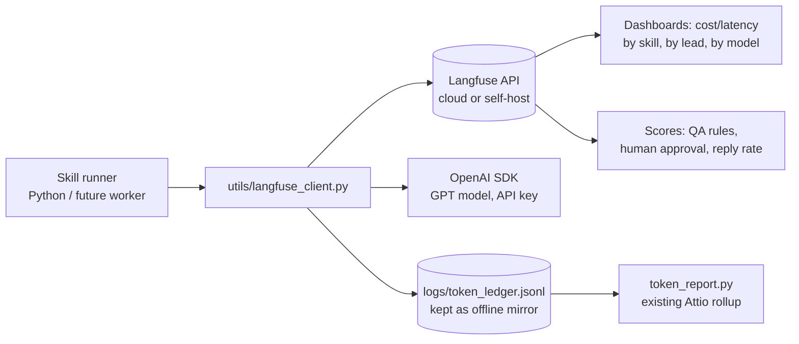

# instrument.md — Langfuse instrumentation plan for skill execution (GPT model via API key)

Status: **Plan / design doc** (no code shipped yet)
Owner: outbound-skills repo (`Outbound_skills_v1`)
Date: 2026-09-26

---

## 1) Why

Today the repo has two weak observability paths for LLM work:

- `utils/token_ledger.py` — append-only JSONL, only fills when a skill is invoked **programmatically** against the Anthropic API. It records tokens and nothing else (no prompt, no output, no latency, no error).
- `utils/session_token_estimator.py` — post-hoc estimate scraped from Claude Code local transcripts, attributed to a lead by name proximity. Useful, but it is a **guess**, arrives after the fact, and is bound to interactive local sessions.

Neither answers the question a batch operator actually asks: *"what did that `/batch-ingest` run cost me?"* See §15 — batch-scoped costing is a first-class requirement here, not a nice-to-have.

Skills (`signal-builder`, `creative-variable`, `email-writer`, `linkedin-dm`, `reply-handler`) are about to move toward the agentic production architecture described in `Documents/skill-to-agent.md`. At that point we need:

- per-skill traces with prompt/output/latency/cost,
- a stable trace identity per **lead**, so a lead's signal scan → email draft → DM → reply classification is one chain, not four orphans,
- evaluation/QA visibility on generated outreach copy,
- a second, independent model lane (GPT) so we can compare quality and cost against Claude.

**Langfuse** gives us traces, generations, prompts-as-code versioning, scores/evals, and cost calc for that, and it works with any OpenAI-compatible endpoint.

---

## 2) Scope

**In scope**

- A single shared `utils/langfuse_client.py` wrapper used by every skill.
- Tracing of programmatic skill runs (the path that fills `token_ledger.py` today), regardless of which LLM provider is called.
- Trace naming/metadata conventions: `skill`, `lead_id`, `channel`, `pipeline_stage`, `model`, `prompt_version`.
- A `batch_id` on every trace/generation/ledger row, so a batch can be costed independently of leads.
- Feeding Langfuse data into the existing token/cost reporting (`token_report.py`, `context/pricing/model-pricing.json`) instead of relying on the transcript estimator.
- A Claude-Code hook as a *best-effort* bridge for interactive sessions.
- **Batch-scoped cost accounting** for `Documents/Batch_Lead_Ingestion.md`: every `/batch-ingest` execution ends with a priced total, broken down by skill, by lead, by model lane, and by gate outcome (§15).

**Out of scope (v1)**

- n8n workflows, webhook handlers and the HITL Google Sheets queue.
- Real-time alerting / PagerDuty wiring.
- Production OpenTelemetry export (Langfuse is the OTel-compatible sink for now).

---

## 3) Architecture



Design rules:

1. **Langfuse is an observer, never a dependency.** If Langfuse is down or un-keyed, the skill must still run and still write the local ledger. All wrapper calls are wrapped in try/except with a short timeout.
2. **One module owns the client.** Skills never import the `langfuse` SDK directly.
3. **The local JSONL ledger stays.** It is the offline source of truth for the Attio rollup; Langfuse is the analytics layer on top.

---

## 4) Credentials and configuration

Two things must be separated clearly:

- **Langfuse credentials** — where traces go.
- **Model credentials** — the GPT API key that actually generates.

### 4.1 Env vars (add to `.env`, mirrored in `.env.example`)

```dotenv
# --- Langfuse (observability) ---
LANGFUSE_HOST=https://cloud.langfuse.com
LANGFUSE_PUBLIC_KEY=pk-lf-xxxxxxxxxxxx
LANGFUSE_SECRET_KEY=sk-lf-xxxxxxxxxxxx
LANGFUSE_ENVIRONMENT=local          # local | staging | prod
LANGFUSE_ENABLED=true               # kill-switch, no code changes needed
LANGFUSE_RELEASE=outbound-skills-v1

# --- Model lane (GPT via OpenAI-compatible API) ---
OPENAI_API_KEY=sk-proj-xxxxxxxxxxxx
OPENAI_BASE_URL=https://api.openai.com/v1
OPENAI_MODEL=gpt-4.1-mini            # per-skill override, see §7
```

> The repo already uses a **local proxy** for the Anthropic lane: `.claude/settings.local.json` points `ANTHROPIC_BASE_URL` at `http://localhost:20128/v1` with a dummy API key plus an `ANTHROPIC_AUTH_TOKEN` — i.e. all model traffic is routed through a local omniroute-style proxy, not straight to the vendor. The GPT lane should mirror that pattern rather than bypass it:
>
> ```dotenv
> OPENAI_BASE_URL=http://localhost:20128/v1
> OPENAI_API_KEY=sk-ant-omniroute-dummy-key
> ```
>
> **Step 0 of implementation is to verify the proxy actually speaks OpenAI-compatible `/v1/chat/completions` and `/v1/responses`**, and that a second, real model key is accepted. If the proxy is Anthropic-protocol-only, keep `OPENAI_BASE_URL=https://api.openai.com/v1` with a real key and route only Langfuse metadata locally. Do not guess this — test with a one-line `chat.completions.create()` smoke call before writing any skill code.

### 4.2 Secret hygiene

- Nothing above goes into `settings.local.json`, into `context/*.md`, or into git. `.env` is already gitignored — confirm it stays that way.
- Langfuse secret key is write-only-for-tracing; use a restricted project key if the Langfuse plan allows it.
- Never log `OPENAI_API_KEY` or `LANGFUSE_SECRET_KEY` in traces metadata. The wrapper must strip keys from any captured input.

---

## 5) New dependencies

```
langfuse>=2.0.0
openai>=1.30.0
```

`langfuse` v2+ ships a decorator and a `CallbackHandler` for the OpenAI SDK; both are used below. `requests` and `python-dotenv` are already present.

---

## 6) The shared wrapper — `utils/langfuse_client.py` (sketch)

```python
"""Langfuse + LLM helper shared by all skills. Never raises."""
from __future__ import annotations

import os
import time
import uuid
from contextlib import contextmanager
from functools import wraps

from dotenv import load_dotenv

load_dotenv()

ENABLED = os.getenv("LANGFUSE_ENABLED", "true").lower() == "true"


def _client():
    if not ENABLED:
        return None
    try:
        from langfuse import Langfuse
        return Langfuse(
            public_key=os.getenv("LANGFUSE_PUBLIC_KEY"),
            secret_key=os.getenv("LANGFUSE_SECRET_KEY"),
            host=os.getenv("LANGFUSE_HOST", "https://cloud.langfuse.com"),
        )
    except Exception:
        return None


@contextmanager
def trace_skill(skill: str, lead_id: str, pipeline_stage: str, channel: str = "email", **meta):
    """Wrap one skill execution in a Langfuse trace. Yields a no-op-safe handle."""
    client = _client()
    if client is None:
        yield None
        return
    try:
        handle = client.trace(
            name=f"{skill}:{pipeline_stage}",
            session_id=f"lead:{lead_id}",
            user_id=lead_id,
            release=os.getenv("LANGFUSE_RELEASE"),
            environment=os.getenv("LANGFUSE_ENVIRONMENT", "local"),
            metadata={"skill": skill, "pipeline_stage": pipeline_stage,
                      "channel": channel, **meta},
            tags=["outbound", skill],
        )
    except Exception:
        handle = None
    try:
        yield handle
    finally:
        try:
            if handle is not None:
                client.flush()
        except Exception:
            pass


def observe_generation(func):
    """Decorator for any function that makes one LLM call."""
    @wraps(func)
    def wrapper(*args, **kwargs):
        started = time.perf_counter()
        client = _client()
        gen = None
        if client is not None:
            try:
                gen = client.generation(
                    name=func.__qualname__,
                    model=kwargs.get("model", os.getenv("OPENAI_MODEL", "unknown")),
                    input=kwargs.get("messages") or kwargs.get("prompt"),
                    metadata={"skill": kwargs.get("skill"), "prompt_version": kwargs.get("prompt_version")},
                )
            except Exception:
                gen = None
        try:
            out = func(*args, **kwargs)
        except Exception as exc:
            if gen is not None:
                try:
                    gen.end(output=None, level="ERROR",
                            status_message=f"{type(exc).__name__}: {exc}")
                except Exception:
                    pass
            raise
        if gen is not None:
            try:
                gen.end(output=out, level="DEFAULT",
                        usage=kwargs.get("_usage"))
            except Exception:
                pass
        return out
    return wrapper
```

Two rules encoded above and worth stating explicitly:

- **Never block the pipeline on telemetry.** Every Langfuse call is inside `try/except`; `flush()` is called at trace end so short-lived CLI processes still ship data.
- **Usage is captured on the generation**, so Langfuse computes cost from its own model registry. That is a second, independent cost source next to `token_ledger.py` — disagreement between the two is a bug signal, not noise (see §9).

### 6.1 Hooking the LLM call (OpenAI)

```python
from openai import OpenAI
client = OpenAI(api_key=os.getenv("OPENAI_API_KEY"),
                base_url=os.getenv("OPENAI_BASE_URL"))

def complete(messages, model=None, **kw):
    with langfuse.start_as_current_generation(
        name="email-writer:generate",
        model=model or os.getenv("OPENAI_MODEL"),
        input=messages,
    ) as gen:
        resp = client.chat.completions.create(
            model=model or os.getenv("OPENAI_MODEL"),
            messages=messages, **kw)
        gen.update(output=resp.choices[0].message.content,
                   usage=resp.usage.model_dump())
        return resp
```

The same `trace_skill` handle can be attached to the Anthropic lane later, so both providers land in one trace.

### 6.2 Writing to the local ledger at the same time

Inside the same call site, after a successful response:

```python
from utils.token_ledger import log_usage
log_usage(lead_id=lead_id, skill="email-writer", model=resp.model,
          input_tokens=resp.usage.prompt_tokens,
          output_tokens=resp.usage.completion_tokens)
```

Langfuse gets the full trace; the JSONL keeps the Attio rollup working untouched.

---

## 7) Per-skill integration points

| Skill | Trace name | Key inputs captured | Custom scores |
|---|---|---|---|
| `signal-builder` | `signal-builder:scan` | company URL, ICP gate result, raw signal text, score | `signal_score` (0–1), `icp_gate_pass` (bool) |
| `creative-variable` | `creative-variable:spec` | angle, ICP, chosen variable | `variable_fallback_used` |
| `email-writer` | `email-writer:generate` | signal summary, offer, tone rules, draft | `qa_rules_passed`, `char_count_ok`, `human_approved` |
| `linkedin-dm` | `linkedin-dm:generate` | channel, draft, policy check | `policy_pass`, `human_approved` |
| `reply-handler` | `reply-handler:classify` | reply text, classification, drafted answer | `classification_confidence`, `escalated` |
| `attio-crm` | `attio-crm:write` | record id, fields written | `write_succeeded` |

Model defaults per skill (overridable per call via `model=`):

- `signal-builder`, `reply-handler` → cheap/fast model (`gpt-4.1-mini`).
- `creative-variable`, `email-writer`, `linkedin-dm` → stronger model (`gpt-4.1`), because copy quality is the product.

### 7.1 Naming and identity conventions

- `trace.name` = `<skill>:<pipeline_stage>` — stable strings so Langfuse aggregates them.
- `session_id` = `lead:<lead_id>` — one session per lead, so the whole funnel chains.
- `user_id` = `lead_id`.
- `tags` always include `outbound` and the skill name.
- A `prompt_version` in generation metadata ties each run to the versioned prompt in `context/playbooks/`.

---

## 8) Two-lane model comparison

Goal: run the same skill on Claude and GPT and compare on cost and quality.

- Same trace/session, two generations, tagged `model_lane=claude` and `model_lane=gpt`.
- A post-hoc `utils/model_eval.py` reads Langfuse generations for a session, and scores both with the skill's QA rubric, emitting a small comparison table.
- Cost comes from Langfuse; token counts cross-checked against `logs/token_ledger.jsonl` for the same `lead_id`.

This is deliberately a **separate** deliverable from instrumentation — v1 of instrumentation only needs one lane working end to end.

---

## 9) Keeping the existing cost reporting honest

`token_report.py` and `context/pricing/model-pricing.json` are Anthropic-shaped (per-million input/output + 5m/1h cache rates). Once GPT calls flow through:

- Add GPT models to `model-pricing.json` in the same shape, or
- Prefer Langfuse's cost as the authority and treat the JSONL as a token-count cross-check only.

Recommendation: **do not hardcode a second pricing table in two places.** Decide once, in §12 step 6, which file is authoritative, and record the decision in `Documents/Decisions/TokenCost.md`.

---

## 10) Interactive Claude Code sessions (best-effort bridge)

The `session_token_estimator.py` path stays, but a hook can be better:

- A Claude Code `SessionStart` / `Stop` hook in `.claude/settings.local.json` reads the current session id and exports `LANGFUSE_SESSION_ID`, plus writes a `lead:` marker when a lead name is set in the session.
- Manual tagging convention: `/lf <lead-name>` sets the active lead for subsequent turns.
- This is a **nice-to-have (v1.1)**. It is not required for the programmatic path and should not block the plan.

---

## 11) Failure modes and mitigations

| Risk | Mitigation |
|---|---|
| Langfuse outage slows or breaks outreach | All calls wrapped, short timeout, `LANGFUSE_ENABLED=false` kill-switch; skill logic never depends on a trace |
| Key leakage into traces | Wrapper strips env keys from captured input; never put `.env` contents in metadata |
| Traces get huge and expensive to ingest | Truncate captured inputs (e.g. 20k chars) and never trace raw email bodies of prospects beyond the draft |
| PII in the observability layer | Leads are business contacts; confirm retention policy and set `LANGFUSE_ENVIRONMENT` per env so local/staging data is separable and purgeable |
| Proxy doesn't support OpenAI protocol | Verified in step 0 before any code; fallback to direct OpenAI key |
| Double counting cost (Langfuse + ledger) | Single authoritative source decided in §9; reports label which one they used |
| The proxy is local-only, breaks in prod | Config is env-only; deployment sets its own `OPENAI_BASE_URL` |

---

## 12) Implementation phases

1. **Step 0 — Verify the model lane.** Confirm `OPENAI_BASE_URL` (proxy or direct) answers `chat.completions.create()` with the configured key. Blocked until this passes.
2. **Phase 1 — Wrapper.** Add `langfuse` + `openai` to `requirements.txt`; create `utils/langfuse_client.py` with `trace_skill`, `observe_generation`, `complete()`; add the env block to `.env.example`; smoke-test with a throwaway trace and confirm it appears in the Langfuse UI.
3. **Phase 2 — First skill wired.** `creative-variable` (lowest blast radius, no sending). Keep writing `log_usage` in the same call site. Verify trace + ledger agree on token counts.
4. **Phase 3 — Remaining generation skills.** `email-writer`, `linkedin-dm`, `reply-handler` (none of them send; sending stays behind the HITL gate in `Documents/HITL_Send_Approval_Design.md`).
5. **Phase 4 — Non-LLM skills.** `signal-builder` (score as a score), `job-search`, `prospect-posts`, `attio-crm` — traced as spans so a lead's trace shows the full chain.
6. **Phase 5 — Cost unification.** Add GPT pricing to `context/pricing/model-pricing.json` or adopt Langfuse cost; update `token_report.py`; note the decision in `Documents/Decisions/TokenCost.md`.
7. **Phase 6 — Dashboards + evals.** Langfuse dashboard: cost/latency by skill, by model lane, by lead. Add QA scores for `email-writer` and `linkedin-dm`; add `human_approved` from the HITL queue.
8. **Phase 7 (v1.1) — Interactive bridge.** Session hooks, `/lf <lead>` tagging, retire reliance on the transcript estimator for day-to-day reporting.

---

## 13) Definition of done

- [ ] Step 0 verified: one real GPT call succeeds through the configured endpoint.
- [ ] `utils/langfuse_client.py` exists, is the only Langfuse import in the repo, and never raises.
- [ ] A skill run produces a Langfuse trace with `skill`, `lead_id`, `pipeline_stage`, `model`, `prompt_version`.
- [ ] `logs/token_ledger.jsonl` still receives the same rows as before instrumentation.
- [ ] `LANGFUSE_ENABLED=false` disables all telemetry with zero behavioural change.
- [ ] Cost is reported from one documented authoritative source.
- [ ] No secret appears in any file tracked by git, nor in any trace payload.

---

## 14) Open questions to resolve during Phase 1

1. Langfuse Cloud vs self-hosted (Docker in this repo? a managed project?). Affects `LANGFUSE_HOST` and whether we need a `docker-compose` for local dev.
2. Does the local proxy at `localhost:20128` support OpenAI protocol, and does it accept a second model key? (Step 0.)
3. Retention: how long do we keep traces containing prospect names and email copy?
4. Do we instrument the HITL approval decision (`human_approved`) as a Langfuse score, or leave it in the Sheets queue and reconcile later?
5. Is one `lead:` session enough, or should sessions be per-pipeline-run to keep traces under Langfuse's size limits?

---

## 15) Batch-scoped cost accounting (per `/batch-ingest` execution)

This section is the answer to *"give me the final token cost of each `Batch_Lead_Ingestion.md` execution"*. It is a **required deliverable**, owned by the instrumentation plan rather than bolted on afterwards.

### 15.1 The gap it closes

`Batch_Lead_Ingestion.md` defines a two-phase run:

- **Fase 1** — `utils/batch_ingest.py prepare` (pure Python, CSV parse / dedup / ICP pre-screen). **Zero LLM tokens.** Must be reported as a flat $0.00 so the operator sees the pre-screen really was free.
- **Fase 2** — `/batch-ingest batches/{batch-name}` (sub-agents running `signal-builder` → `creative-variable` → `email-writer` + `linkedin-dm` → `sheet_queue.py`).

Today a Fase 2 run leaves no aggregate cost artifact: the ledger rows are per-lead, and lead ids are slugs like `darren-nix-steadily` with no link back to the batch that produced them. Costing a batch therefore means guessing which rows belong to it. This section makes that explicit.

### 15.2 Batch identity

A batch is identified by `batch_name`, which is already the directory name (`batches/batch-2026-09-08/manifest.json` → `batch_name`). Every row and every trace carries it.

- Langfuse: `trace.metadata.batch_id = batch_name`, and `session_id` stays `lead:<lead_id>` so lead chaining is unaffected. Add a second dimension via `session_id` grouping in the UI, not by changing the session convention.
- Local ledger: add `batch_id: str | None = None` to `UsageRecord` and to `log_usage(...)`. **Default `None` so existing callers and existing ledger rows keep working unchanged.** Old rows simply have no batch and are excluded from batch reports.

Do **not** make `batch_id` required — Fase 1 produces no rows, and manual single-lead runs outside a batch must not be forced to invent a batch id.

### 15.3 Ledger change (minimal, backwards compatible)

`utils/token_ledger.py` needs exactly one field and one keyword arg:

```python
@dataclass(frozen=True)
class UsageRecord:
    timestamp: str
    lead_id: str
    skill: str
    model: str
    input_tokens: int
    output_tokens: int
    cache_creation_input_tokens: int
    cache_read_input_tokens: int
    batch_id: str | None = None      # NEW — absent/None for non-batch runs
```

and `log_usage(..., batch_id: str | None = None)`, plus a CLI flag `--batch-id`. `read_ledger()` gains `batch_id: str | None = None` filtering:

```python
def read_ledger(lead_id=None, batch_id=None, ledger_path=LEDGER_PATH):
    ...
    if lead_id is not None and record.get("lead_id") != lead_id:
        continue
    if batch_id is not None and record.get("batch_id") != batch_id:
        continue
    records.append(record)
```

Nothing else in the file changes. `json.dumps(asdict(record))` picks the new key up automatically.

### 15.4 New script — `utils/batch_cost_report.py`

Modeled directly on `utils/token_report.py` (same pricing source, same `compute_cost` math, same warning behaviour) but aggregated over a batch. Reuse `token_report.compute_cost` rather than re-implementing pricing — one pricing authority, no drift.

```
python utils/batch_cost_report.py --batch batch-2026-09-08
python utils/batch_cost_report.py --batch batch-2026-09-08 --format json
python utils/batch_cost_report.py --batch batch-2026-09-08 --write-summary   # patches batches/{batch}/summary.md
```

Reads `batches/{batch}/manifest.json` + `results/*.json` to split the population into **passed ICP gate** vs **rejected at gate 2**, and the ledger filtered by `batch_id` to price it. Output shape:

```json
{
  "batch_name": "batch-2026-09-08",
  "manifest_stats": {
    "total_csv_rows": 26, "duplicates_removed": 2,
    "failed_pre_screen": 12, "qualified_for_pipeline": 12
  },
  "pipeline": {
    "leads_entered": 12,
    "leads_passed_icp_gate": 8,
    "leads_rejected_icp_gate": 4
  },
  "calls": 47,
  "totals": {"input_tokens": 184300, "output_tokens": 41200, "cost_usd": 0.7421},
  "by_skill": {
    "signal-builder": {"calls": 12, "input_tokens": 62000, "output_tokens": 9800,  "cost_usd": 0.2100},
    "creative-variable": {"calls": 8,  "input_tokens": 31000, "output_tokens": 7400,  "cost_usd": 0.1560},
    "email-writer":      {"calls": 8,  "input_tokens": 58000, "output_tokens": 15200, "cost_usd": 0.2680},
    "linkedin-dm":       {"calls": 8,  "input_tokens": 27300, "output_tokens": 7400,  "cost_usd": 0.0930},
    "attio-crm":         {"calls": 3,  "input_tokens": 6000,  "output_tokens": 1400,  "cost_usd": 0.0151}
  },
  "by_model": {
    "claude-sonnet-5": {"calls": 30, "cost_usd": 0.5100},
    "gpt-4.1":        {"calls": 17, "cost_usd": 0.2321}
  },
  "by_gate_outcome": {
    "passed_icp_gate":   {"leads": 8, "cost_usd": 0.7050},
    "rejected_icp_gate": {"leads": 4, "cost_usd": 0.0371}
  },
  "cost_per_completed_lead_usd": 0.0881,
  "cost_per_csv_row_usd": 0.0285,
  "unpriced_models": [],
  "generated_at": "2026-09-08T14:42:33Z"
}
```

Three derived numbers worth surfacing every run, because they are the ones that change behaviour:

- **`cost_per_completed_lead_usd`** — total cost ÷ leads that produced a draft. This is the number to compare across batches and to compare Claude vs GPT lanes.
- **`rejected_icp_gate` cost** — what the ICP gate saved by stopping early, and what it cost to run `signal-builder` on leads that then failed Step 0. If this climbs, the pre-screen in Fase 1 needs tightening.
- **Fase 1 cost is structurally 0** — reported explicitly as a line item, never silently omitted, so the operator can see the pre-screen burned no tokens.

### 15.5 Where the number surfaces at the end of a run

Three places, in order of immediacy:

1. **Chat, one line** — the `/batch-ingest` command's final output (the doc already mandates a 1-line summary; extend it to include cost):
   ```
   Processed 12 leads: 8 completed, 4 rejected at ICP gate — $0.7421 total, $0.0881/completed lead
   ```
2. **`batches/{batch}/summary.md`** — a new `## Token Cost` section, appended/rewritten by `--write-summary`, sitting alongside the existing Stats / Rejected / Drafts Queued sections. The doc's existing report format does not currently have a cost table, so this is an addition, not an edit of a table that exists.
3. **Machine-readable** — `batches/{batch}/cost_report.json`, the exact payload above. This is the artifact a scheduler or n8n flow can read later, and the input to a cross-batch trend line.

### 15.6 Interaction with Langfuse

- Langfuse remains the cross-cutting analytics view; the batch report is the **offline, reproducible** number that survives Langfuse being unreachable.
- Reconcile once per batch: sum `by_model.calls` from `cost_report.json` against the Langfuse generation count for that `batch_id`. A mismatch means a skill logged to one sink and not the other — a real bug, per the double-counting rule in §11.
- Cost per lead, reported by Langfuse and by this script, should agree to the cent. Where they do not, `Documents/Decisions/TokenCost.md` records which is authoritative and why.

### 15.7 Missing-data honesty

A batch run where skills executed inside interactive Claude Code sub-agents — rather than through the instrumented Python path — will produce **fewer ledger rows than executed skills**. In that case the report must say so rather than print a confidently small number:

- If `calls == 0` for a batch that clearly ran skills → report `cost_usd: null` with `"note": "no instrumented LLM calls recorded for this batch; costs estimated via session_token_estimator.py"` and point at the estimator, not at $0.00.
- Any model missing from `context/pricing/model-pricing.json` goes into `unpriced_models` and is excluded from the cost total, with a stderr warning — the same rule `token_report.py` already applies. A missing GPT entry therefore degrades to a stated undercount, not a wrong number.

### 15.8 Added phases

Insert into §12's phase list, after Phase 5 (cost unification):

- **Phase 5b — Batch cost.** Add `batch_id` to `token_ledger.py`; create `utils/batch_cost_report.py`; extend the `/batch-ingest` command to emit the one-line cost summary and call `--write-summary`. Acceptance: a real batch produces a `cost_report.json` whose `by_skill` call counts match the number of skill invocations recorded in `batches/{batch}/processing.log`.

