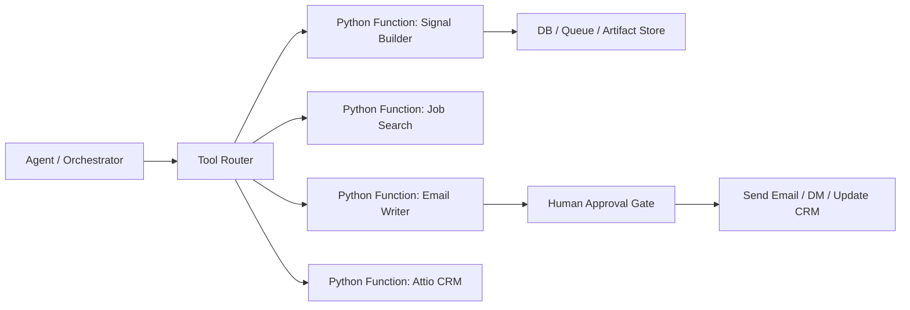

# Skill-to-Agent: factibilidad para convertir skills en tools y llevarlas a producción fuera de local

## Resumen ejecutivo

La conversión es factible y recomendable, pero no como una migración literal de “skill de Claude Code” a “tool Python” sin cambiar la arquitectura. El repo actual ya está estructurado como un pipeline deliberado de habilidades con inputs/outputs bien definidos, contextos compartidos y utilidades Python existentes. Eso es un excelente punto de partida para una arquitectura agentic desplegada fuera de la máquina local.

La conclusión práctica es esta:

- Sí es viable convertir cada skill en un tool o servicio ejecutable en un entorno remoto.
- No todos deben ser “tools puramente deterministas”; algunos deben permanecer como pasos de agente con inteligencia y aprobación humana.
- La mejor arquitectura es híbrida: Python functions para lógica estructurada + orchestrator/agent para coordinación, decisión y control de flujo.
- La producción necesita una capa de API/worker, persistencia, autenticación, colas, trazabilidad y gates de aprobación, porque los skills actuales asumen contexto local y ejecución interactiva.

## 1) Qué ya hace este repositorio que favorece la conversión

El proyecto ya tiene varias señales de factibilidad:

- Distinción clara entre context layer y execution layer.
- Inputs y outputs documentados en cada skill.
- Dependencias de Python ya presentes en `requirements.txt`.
- Utilidades reales en `utils/` para trabajos como Colas, tokens, prospect posts, webhook, etc.
- Pipeline de negocio definido en README: `gtm-context -> signal-builder -> creative-variable -> email-writer -> attio-crm` y `reply-handler` de vuelta al CRM.
- La lógica está desacoplada en capas funcionales, no en una monolítica improvisada.

Esto reduce el trabajo de transformación: el proyecto no está empezando desde cero, está ya modelando una arquitectura con responsabilidades separadas.

## 2) Factibilidad por tipo de skill

### 2.1 Skills altamente factibles como tools

Estas tienen un patrón muy compatible con funciones Python y pueden convertirse en endpoints o workers estables.

| Skill | Tipo | Factibilidad | Motivo |
|---|---|---:|---|
| `gtm-context` | Context / setup | Alta | Ejecuta validación de archivos, definiciones de oferta/ICP, y produce documentos estructurados |
| `signal-builder` | Análisis de señales | Alta | Se puede encapsular como función que toma URL, contexto y devuelve señal y score |
| `job-search` | Búsqueda de trabajo | Alta | Lógica de API + filtros + normalización, muy adecuada para worker |
| `prospect-posts` | Scraping / extracción | Alta | Función con entrada de URL y keyword, salida estructurada y reutilizable |
| `creative-variable` | Generación de variables | Alta | Lógica de especificación y personalización, idónea para servicio |
| `attio-crm` | Integración CRM | Alta | CRUD y notas con API, muy natural como tool o servicio backend |

### 2.2 Skills factibles como agent tasks con tool-calling

Estas tienen componentes de lenguaje y decisión más fuertes. No deben reducírseles a una función simple sin un agente que orqueste.

| Skill | Tipo | Factibilidad | Motivo |
|---|---|---:|---|
| `email-writer` | Generación de copy | Media-alta | Muy buena para LLM + política + QA; requiere validación y aprobación |
| `linkedin-dm` | Mensaje / envío | Media-alta | Puede ser tool de generación + tool de envío, pero requiere compliance y límites |
| `reply-handler` | Clasificación y respuesta | Media-alta | Lógica semántica + decisiones de routing + task creation |

### 2.3 Skill que requiere reframing arquitectónico

| Skill | Tipo | Factibilidad | Motivo |
|---|---|---:|---|
| `gtm-context` | Front-end de onboarding | Alta, pero no como tool aislado | Debe ser un workflow guiado, no solo un call sin contexto humano |

## 3) Modelo recomendado: hybrid agentic architecture

La mejor versión no es “cada skill = un endpoint Python independiente con un prompt”. Eso sería una simplificación peligrosa. La mejor estructura es:

1. Core deterministic tools
   - Python functions que hacen el trabajo real.
   - Validados, testables, idempotentes.
   - Expuestos como endpoints o llamados por workers.

2. Agent orchestrator layer
   - Decide qué tool invocar, con qué parámetros y en qué orden.
   - Maneja el estado del lead/prospect.
   - Ejecuta LLM cuando la salida necesita razonamiento o generación de texto.

3. Human approval layer
   - Previene envío de emails, mensajes o CRM writes con impacto comercial.
   - Especialmente para email, LinkedIn y cambios de pipeline.

4. External integrations layer
   - Attio, TheirStack, Apify, Unipile, Google Sheets, webhook, email sender.

## 4) Mapeo propuesto: skill -> Python function -> tool

A continuación el mapeo recomendado para producción.

### 4.1 `gtm-context`

Función objetivo:

```python
def upsert_context_bundle(
    workspace_id: str,
    offer: dict,
    icp: dict,
    outreach_files: dict,
    user_id: str,
) -> dict:
    ...
```

Responsabilidad:
- Guardar/actualizar `offer.md` y `icp.md` como estructura JSON o documentos.
- Validar que los campos necesarios existen.
- Devolver estado y observaciones de completitud.

Modo de producción:
- API endpoint `/context/validate` o `/context/upsert`
- Se utiliza antes de cualquier pipeline.

### 4.2 `signal-builder`

Función objetivo:

```python
def build_signal_scan(
    company_url: str,
    offer_context: dict,
    icp_context: dict,
    enrichment_data: dict | None = None,
) -> dict:
    ...
```

Responsabilidad:
- Validar ICP hard-gate.
- Obtener website data.
- Clasificar señales.
- Calcular score y recomendación.
- Devolver estructura con señales, ranking y fallback.

Modo de producción:
- Worker asíncrono.
- Resultado persistido en base de datos o object storage.
- Se publica un evento `signal_scan_completed`.

### 4.3 `job-search`

Función objetivo:

```python
def fetch_jobs_for_companies(
    companies: list[str],
    roles: list[str] | None = None,
    time_window_days: int = 30,
) -> list[dict]:
    ...
```

Responsabilidad:
- Llamar TheirStack API.
- Normalizar resultados.
- Generar señales de hiring.

### 4.4 `prospect-posts`

Función objetivo:

```python
def analyze_profile_posts(
    profile_url: str,
    theme: str,
    limit: int = 10,
) -> dict:
    ...
```

Responsabilidad:
- Traer posts de LinkedIn/Apify.
- Scoring de tema.
- Emitir findings útiles para outreach.

### 4.5 `creative-variable`

Función objetivo:

```python
def synthesize_variable_spec(
    campaign_angle: str,
    icp: dict,
    source_material: list[str] | None = None,
) -> dict:
    ...
```

Responsabilidad:
- Definir variables, fuentes, fallbacks y buenas prácticas.
- Generate prompt-ready artifact.

### 4.6 `email-writer`

Función objetivo:

```python
def generate_campaign_sequence(
    signal_data: dict,
    offer_context: dict,
    prospect_context: dict,
    tone_rules: dict,
) -> dict:
    ...
```

Responsabilidad:
- Producir Email 1, Email 2, Email 3.
- Ejecutar QA rules.
- Devolver payload listo para aprobación o cola.

Este es un caso perfecto de “agent task + tool”:
- Tool: generar el draft.
- Agent: evaluar si se cumplen las reglas, si la persona coincide, si el signal es relevante.
- Human: revisar y aprobar.

### 4.7 `linkedin-dm`

Función objetivo:

```python
def generate_dm_sequence(
    signal_data: dict,
    offer_context: dict,
    prospect_context: dict,
    channel: str = "linkedin",
) -> dict:
    ...
```

Responsabilidad:
- Generar connection note + DM sequence.
- Enviar a Unipile si la política lo permite.

### 4.8 `attio-crm`

Funciones objetivo:

```python
def upsert_company(domain: str, payload: dict) -> dict: ...
def upsert_person(email: str, payload: dict) -> dict: ...
def create_signal_note(person_id: str, signal_payload: dict) -> dict: ...
def create_follow_up_task(person_id: str, content: str, due_in_hours: int = 24) -> dict: ...
```

Esto es ideal para backend y no debería depender de un entorno local. Tiene claridad de contrato, validación y trazabilidad.

### 4.9 `reply-handler`

Función objetivo:

```python
def classify_reply(reply_text: str, context: dict) -> dict:
    ...
```

Responsabilidad:
- Determinar categoría: interested, not interested, question, objection, etc.
- Generar respuesta.
- Trigger de follow-up.

## 5) Arquitectura orientada a producción

### 5.1 Capa de servicio

Propuesta técnica base:

- API: FastAPI
- Workers: Celery / RQ / Temporal (según complejidad)
- Base de datos: PostgreSQL
- Cache / queue: Redis
- Files / artifacts: S3, GCS o blob storage
- Observability: OpenTelemetry + structured logs + Prometheus/Grafana

### 5.2 Flujo de ejecución



### 5.3 Persistencia recomendada

Necesitas guardar al menos:

- `prospect_id`
- `company_url`
- `signal_score`
- `campaign_type`
- `draft_id`
- `channel (email/linkedin/both)`
- `approval_status`
- `status_history`
- `source_artifacts` (signal scan, context bundle, generated copy)

Esto permite rehidratación, auditabilidad y replay sin depender de la sesión local de Claude.

## 6) Qué debe cambiar respecto al modelo actual de skills

El modo actual asume:

- archivos locales del workspace
- ejecución interactiva en CLI
- prompts de usuario en sesión
- contexto cargado manualmente o por memoria local

Para producción fuera de local, hay que añadir:

- persistencia explícita del estado
- APIs autenticadas
- aislamiento entre tasks
- idempotencia por lead y accion
- control de rate limits y reintentos
- trazas y logs estructurados
- límites de seguridad para external API keys
- secret management (Vault / AWS Secrets / env vars cifradas)

## 7) Riesgos reales y cómo mitigarlos

### 7.1 Dependencia de contexto local

Riesgo: los skills asumen que `context/offer.md` y `context/icp.md` existen en el filesystem local.

Solución:
- Persistir contexto en base de datos o blob objects.
- Cada task recibe contexto explícito como payload JSON.
- El orchestrator no debe depender de la sesión local para leer archivos.

### 7.2 Generación de copy sin control humano

Riesgo: un email o DM puede salir mal, spam, o ser irrelevante.

Solución:
- Gate de aprobación para Email 1 y mensajes de alta sensibilidad.
- Reglas de QA en backend antes de enviar.
- `approval_status` en cada draft.

### 7.3 Duplicados de registros en CRM

Riesgo: upsert sobre personas/empresas sin idempotencia.

Solución:
- Claves naturales: email, domain, LinkedIn URL.
- `external_id` y `source` en cada registro.
- Deduplicación automática antes de escribir.

### 7.4 Partial failures entre stages

Riesgo: signal ok, email generado, Attio update falló.

Solución:
- Pipeline con steps atómicos y reintentos.
- Estado por stage: `pending`, `done`, `failed`, `requires_review`.

### 7.5 Seguridad y secretos

Riesgo: keys en repo o sesión local.

Solución:
- No hardcodear secrets.
- Secret manager y permisos por servicio.
- Revisar token scopes y rotación.

## 8) Recomendación de diseño final

### Arquitectura recomendada

- `Agent Runtime`: orquesta el flujo general y toma decisiones de negocio.
- `Python tools`: ejecutan lógica estructurada y contactos a API.
- `Datastore`: guarda prospectos, contextos, señales, drafts, decisiones.
- `Integration layer`: Attio, Theirstack, Apify, Unipile, Sheets.
- `Approval layer`: mantiene el control humano para outreach.

### Ejemplo de flujo real

```text
1. Crear prospecto o lead
2. Cargar contexto de oferta y ICP desde base de datos
3. Ejecutar signal-builder tool
4. Guardar señal con score y ranking
5. Ejecutar email-writer tool
6. QA y aprobación humana
7. Upsert en Attio
8. Colear draft en Google Sheets o sistema de envío
9. Si hay reply, ejecutar reply-handler y actualizar CRM
```

## 9) Criterio de decisión: ¿convertir o no convertir?

### Conviene convertir a tools

- `signal-builder`
- `job-search`
- `prospect-posts`
- `creative-variable`
- `attio-crm`
- `gtm-context` (como servicio de contexto)

### No conviene convertir como “tools sueltos”

- `email-writer` y `reply-handler` como pure function sin agente.
- Deben vivir como “agentic tasks” con validación y revisión.

### Regla de oro

Un skill que se puede medir y validar con datos estructurados es candidato a tool. Un skill que depende de lenguaje, juicio, tono o política comercial debe vivir como un agente con herramientas.

## 10) Evaluación final

### Resultado general

- Factibilidad técnica: Alta
- Factibilidad operativa: Media-alta
- Complejidad de migración: Media
- Riesgo si se hace como copia ingenua de skills: Alto
- Riesgo si se hace como arquitectura híbrida con Python tools + agent orchestrator: Bajo-medio y controlado

### Conclusión

Sí es viable convertir este conjunto de skills en una arquitectura agentic desplegada fuera del entorno local. El repositorio ya está preparado para ello porque ya separa contexto, señales, personalización y CRM, y porque tiene utilidades Python útiles.

La clave no es “traducir cada skill a Python”. La clave es convertir cada skill en una unidad de ejecución con contrato claro: una funcionalidad determinista o un agente con herramientas, según su naturaleza. Esa es la diferencia entre un prototipo local y un sistema productivo.

## 11) Propuesta de implementación en fases

### Fase 1: extracción de tools deterministas
- Exponer `signal-builder`, `job-search`, `prospect-posts`, `attio-crm` como endpoints o workers.
- Guardar payloads y outputs como JSON.

### Fase 2: agregar capa de orquestación
- Crear un agente que reciba una empresa, lea contexto, invoque tools y decida el próximo paso.

### Fase 3: introducir aprobación humana
- Draft queue para emails.
- Workflow visual de approval.

### Fase 4: despliegue
- FastAPI + workers + Redis + Postgres + observability.
- Deploy en cloud (Render, Railway, Fly.io, Azure Container Apps, etc.).

## 12) Recomendación final para este repo

El mejor plan para este proyecto es:

1. Mantener el modelo conceptual de skills.
2. Extraer la lógica operativa a Python functions y servicios.
3. Usar un orchestrator agent que invoque esos tools según el flujo de negocio.
4. Dejar la generación y envío de copy bajo validación humana.
5. Desplegar fuera del entorno local con infraestructura asíncrona y persistencia real.

Eso convierte el repo de un sistema de “Claude Code local” a un sistema de automatización de GTM con producción, trazabilidad y control operacional.
