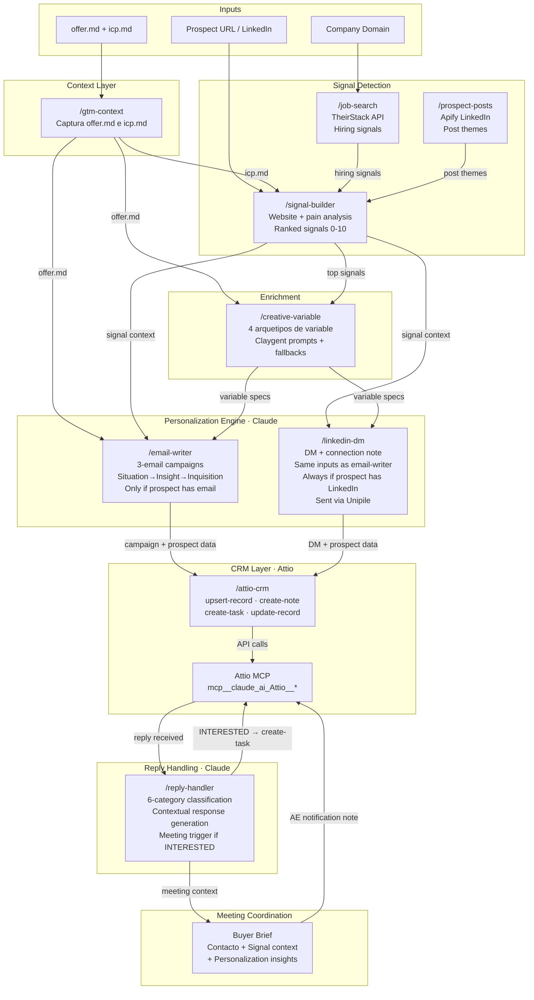

# Zevenue GTM Skills

The methodology layer [Zevenue](https://zevenue.com) runs on top of Claude Code. These are the Claude Code skills we use to turn outbound from a guessing game into an engineering discipline — productized and shareable.

If you run outbound, do RevOps, or build GTM systems, these are drop-in skills that encode the frameworks we've tuned across four years of GTM delivery.

## What's in here

Run [`gtm-context`](.claude/skills/gtm-context/) **first**. It writes the context layer (`offer.md`, `icp.md`) that every other skill reads from. Skip this and downstream output quality drops sharply.

| Skill | Layer | What it does |
|---|---|---|
| [`gtm-context`](.claude/skills/gtm-context/) | Context | **Run this first.** Walks you through capturing your offer, ICP, and engagement signals. Writes `context/offer.md` and `context/icp.md`. Every other skill reads from these. |
| [`signal-builder`](.claude/skills/signal-builder/) | Signal Detection | Scans a prospect's website + enrichment data and produces a ranked signal analysis. Scores each signal 1-10 and recommends a campaign approach per signal. |
| [`job-search`](.claude/skills/job-search/) | Signal Detection | Queries the TheirStack API for job postings at a set of companies. Hiring patterns are one of the strongest timing signals for outbound. |
| [`prospect-posts`](.claude/skills/prospect-posts/) | Signal Detection | Scrapes recent LinkedIn posts from one or more prospect profiles via Apify and scans them for a given theme. Useful for account intelligence. |
| [`creative-variable`](.claude/skills/creative-variable/) | Enrichment | Specs the personalization variables for a campaign — names, grammar, sources, Claygent prompts, fallbacks, rendered examples. Encodes the four archetypes (verbatim-pain, manual-task, strategic-alternative, failure-mode). |
| [`email-writer`](.claude/skills/email-writer/) | Personalization (Claude) | Generates 3-email cold campaigns using the Situation → Insight → Inquisition methodology. Enforces deliverability rules, word limits, and a QA checklist. Runs whenever the prospect has an email. |
| [`linkedin-dm`](.claude/skills/linkedin-dm/) | Personalization (Claude) | Generates LinkedIn connection notes + DMs using the same Situation → Insight → Inquisition methodology and the same inputs as `email-writer`. Sends via the Unipile API. Runs in parallel with `email-writer` whenever the prospect has a LinkedIn profile — the only channel when there's no email. |
| [`attio-crm`](.claude/skills/attio-crm/) | CRM (Attio) | Pushes prospect data, signal context, campaigns, and deal stages into Attio via MCP. Replaces HubSpot for all lead management operations. |
| [`reply-handler`](.claude/skills/reply-handler/) | Reply Handling (Claude) | Classifies incoming replies into 6 categories, generates contextually appropriate responses, and updates Attio. 90% of interactions handled without human intervention. |

## Framework



They chain:

```
gtm-context    → (writes context/offer.md + context/icp.md, read by every skill below)
signal-builder → creative-variable → email-writer  → attio-crm   (if prospect has email)
                                    → linkedin-dm   → attio-crm   (always, if prospect has LinkedIn — parallel to email-writer, via Unipile)
job-search     → signal-builder                                  (hiring is a signal input)
prospect-posts → signal-builder                                  (content signals feed targeting)
attio-crm      ← reply-handler                                   (reply loop back to CRM)
```

## Core Components

| PDF Component | This Stack |
|---|---|
| Clay (signal detection) | `/signal-builder` + `/job-search` + `/prospect-posts` |
| ~~GPT-4~~ (personalization) | **Claude** — `/email-writer` + `/reply-handler` |
| n8n (workflow) | Claude Code skill chaining |
| Apollo (enrichment) | `/job-search` (TheirStack) + `/prospect-posts` (Apify) |
| ~~HubSpot~~ (CRM) | **Attio** via MCP — `/attio-crm` |

## Install

1. **Clone into your workspace** — these skills assume a Claude Code project structure:
   ```bash
   git clone https://github.com/Zevenue/gtm-skills.git
   cd gtm-skills
   ```
2. **Install the skills.** Either:
   - **Globally** (recommended) — copy `.claude/skills/*` into `~/.claude/skills/` so they're available in every Claude Code session, or
   - **Per project** — copy `.claude/skills/*` into your project's `.claude/skills/`, or run Claude Code from this directory directly.
3. **Copy `utils/` and the entire `context/` directory into your project root.** The skills reference paths under `context/outreach/`, `context/playbooks/`, and (optionally) `context/offer.md`.
4. **Set up the environment:**
   ```bash
   cp .env.example .env
   # Fill in APIFY_API_TOKEN, THEIRSTACK_API_KEY, and UNIPILE_API_KEY/UNIPILE_DSN as needed
   pip install -r requirements.txt
   ```
   Python 3.10+ recommended. `signal-builder`, `email-writer`, and `creative-variable` need no Python or API keys at all.

### API keys

| Variable | Used by | Get one at |
|---|---|---|
| `APIFY_API_TOKEN` | `prospect-posts` | https://console.apify.com/account/integrations |
| `THEIRSTACK_API_KEY` | `job-search` | https://app.theirstack.com/settings/api |
| `UNIPILE_API_KEY`, `UNIPILE_DSN` | `linkedin-dm` | https://dashboard.unipile.com (DSN is the account-specific base URL Unipile assigns, e.g. `https://api60.unipile.com:19028`) |

`signal-builder`, `email-writer`, `creative-variable`, `attio-crm`, and `reply-handler` need no external API keys — they run on Claude + your context.

`attio-crm` uses the Attio MCP server (`claude.ai Attio`) — connect it via Claude Code's MCP integrations. No `.env` key needed once connected.

## Use

In Claude Code, invoke by name. **Run `/gtm-context` first** to set up the context layer — every other skill loads from it.

```
/gtm-context                                                         (run first, once per workspace)
/signal-builder    https://prospect.com  [offer-context]
/email-writer      [signal output]       [offer-context]       [prospect info]        (only if prospect has email)
/linkedin-dm       [signal output]       [offer-context]       [prospect info incl. linkedin url]  (parallel to email-writer, or standalone if no email)
/creative-variable [campaign angle]      [ICP]                 [existing copy?]
/job-search        stripe.com,notion.so  --title "SDR,BDR"
/prospect-posts    https://linkedin.com/in/someone  "AI-first GTM"
/attio-crm         [prospect data]       [signal output]                         (log to Attio CRM)
/reply-handler     [reply text]          [original email]      [signal context]  (classify + respond)
```

Each skill's `skill.md` is the authoritative spec for what it expects and what it returns.

## How to think about these

These skills are opinionated. They encode judgments like:

- **Three emails per sequence (max).** If three well-targeted emails don't land, more won't help — the signal or the angle was wrong.
- **The message is only as good as the list.** If you need heavy personalization to make copy work, your targeting is wrong.
- **Ask for truth, not time.** Cold email CTAs should be "Is this you?" not "Can we schedule 30 minutes?"
- **Every signal has a score.** A 4/10 is fine — it helps the Email Writer calibrate tone.

See `context/outreach/outreach-principles.md` for the full framework.


## License

MIT. See [LICENSE](LICENSE).

## About Zevenue

[Zevenue](https://zevenue.com) is a Toronto-based GTM engineering firm. We build custom outbound + RevOps systems for GTM teams. Reach me at: yusuf@zevenue.com
